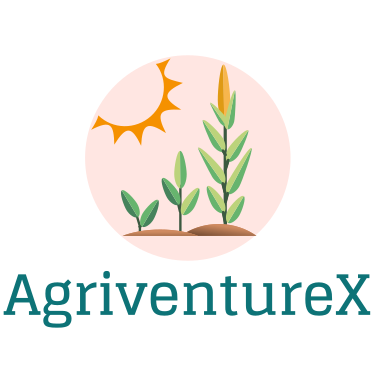
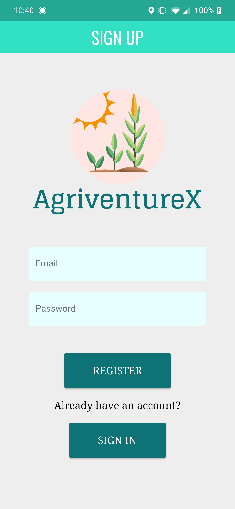
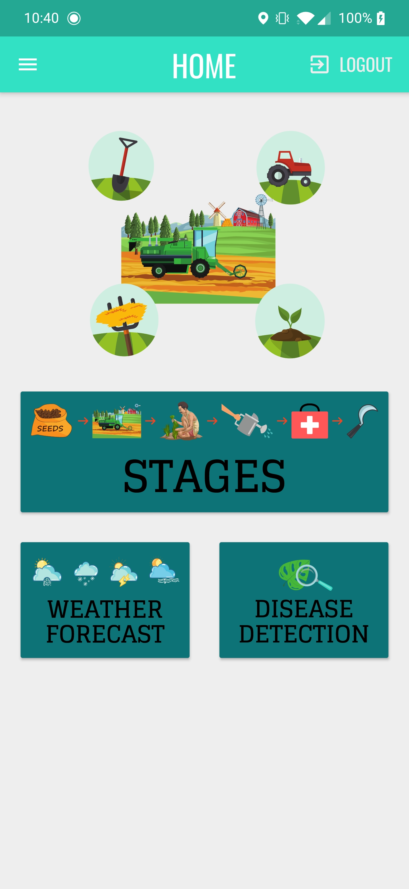
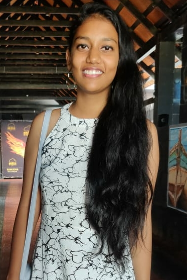
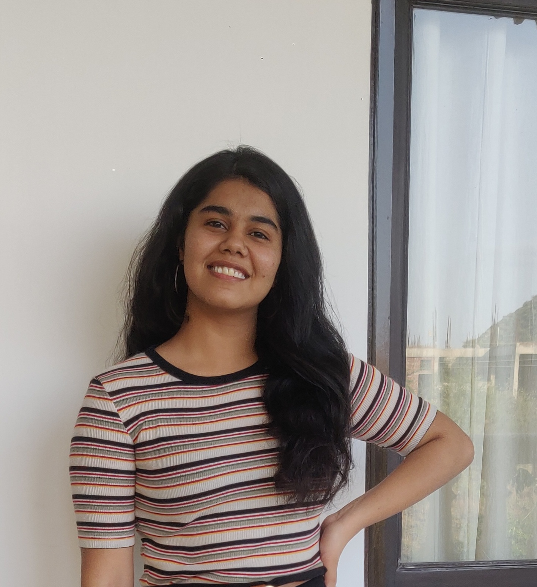
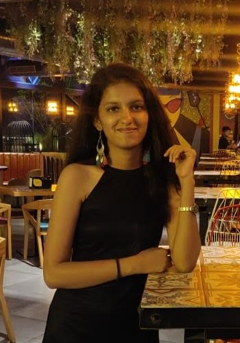

	<h4 align="center">  AgriventureX is a mobile application that guides farmers throughout the crop cycle. It was designed specifically to fulfill all the major needs of a farmer and perhaps, even more.<h4>

---

## Preview
**<h3> The SignUP Page </h3>**
   
**<h3> The Home Page </h3>**
 

## Functionalities
- [x] Thorough Guidance from sowing till harvesting considering multiple factors like weather. Currently functions for 5 major crops in India.
- [x] Machine learning model that predicts weather based on month entered by user.
- [x] Machine learning model that performs crop disease detection on image entered by user.
- [x] Location Detection.

## Contributors

<table width:100%>
<tr align="center">

<td widht:100%>

Pooja Selvaraj

</td>

<td widht:25%>

Vallari Narang

</td>

<td widht:25%>

Tarushi Pathak

</td>

<td widht:25%>

Devanshi Karthik

</td>
</tr>
  </table>

	Made with :heart: by the Team Big Byte Theory </a>

